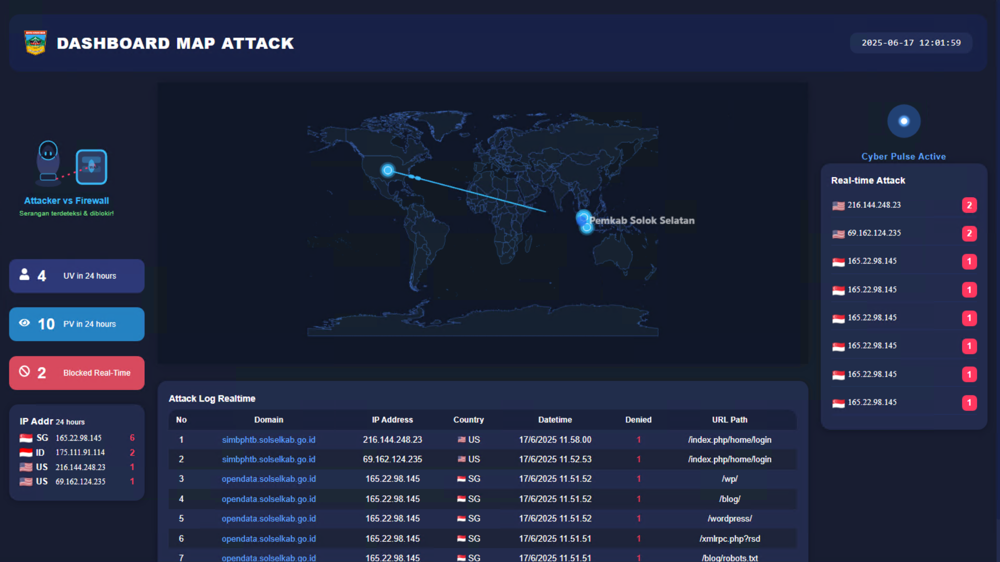

# Attack Map Dashboard



**Attack Map Dashboard** adalah aplikasi dashboard monitoring serangan siber secara real-time yang menampilkan peta sumber serangan, statistik harian, serta log aktivitas upaya serangan ke sistem web milik Pemkab Solok Selatan.

Aplikasi ini dikembangkan menggunakan **Python** dan terintegrasi langsung dengan **SafeLine WAF API** untuk menarik data serangan secara otomatis dan real-time.

---

## Fitur Utama

- 🌍 **Live Attack Map**: Visualisasi sumber serangan di peta dunia terhadap server Solok Selatan.
- 🕒 **Statistik Real-time**: Menampilkan jumlah pengunjung unik, page view, dan total serangan yang berhasil diblokir selama 24 jam terakhir.
- 📜 **Attack Log Realtime**: Daftar log upaya serangan, termasuk domain, IP, negara, waktu, dan status blokir.
- 🔴 **Notifikasi Serangan**: Panel notifikasi serangan terbaru secara otomatis.
- 🔗 **Integrasi SafeLine WAF**: Menarik data serangan dari SafeLine secara otomatis melalui API.

---

## ✨ Versi Aplikasi

### 1. Full Python (Pure Python, tanpa JavaScript)
- **Fitur:** Tampilan sederhana tanpa JavaScript, tetap menampilkan data serangan dan peta.
- **Teknologi:** Backend Python (FastAPI/Flask), Template HTML sederhana.
- **Screenshot:**

  

### 2. NoJS (Modern, dengan ReactJS)
- **Fitur:** Dashboard modern, peta interaktif, animasi real-time, tampilan smooth dan responsif.
- **Teknologi:** Backend Python (FastAPI), Frontend ReactJS, TailwindCSS.
- **Screenshot:**

  

---

## 🟢 Kelebihan & Kekurangan

### Versi 1 – Full Python (Pure Python, tanpa JavaScript)
| Kelebihan                             | Kekurangan                                     |
|----------------------------------------|------------------------------------------------|
| Tampilan modern & interaktif           | Membutuhkan resource lebih besar (RAM/CPU)     |
| Animasi peta serangan real-time        | Proses load animasi attack map bisa berat      |
| Statistik & log real-time responsif    | Tidak cocok untuk server spesifikasi rendah     |


### Versi 2 – NoJS (ReactJS Frontend + FastAPI Backen)
| Kelebihan                                | Kekurangan                                  |
|-------------------------------------------|---------------------------------------------|
| Sangat ringan, minim resource             | -                    |
| Bisa jalan di server spesifikasi rendah   | -                    |
| Mudah diintegrasi ke sistem legacy        | -            |
| Setup frontend dan backend terpisah       | -            |
| User experience lancar & smooth        | -  |
| Support multi-user & skala besar       | -            |

---

## Integrasi SafeLine WAF

Dashboard ini menggunakan [**SafeLine Web Application Firewall (WAF)**](https://www.chaitin.cn/en/safeline/) untuk mengambil data serangan dan log keamanan secara otomatis.  
SafeLine WAF membantu melindungi aplikasi web dari serangan siber seperti SQL Injection, XSS, dan serangan layer aplikasi lainnya.

Aplikasi ini secara berkala melakukan request ke endpoint [SafeLine API](https://docs.chaitin.cn/safeline/), lalu menampilkan statistik dan log secara real-time di dashboard.

---

Untuk sekarang saya upload baru versi 1 nya, versi 2 masih cooming soon untuk saya upload..!

## Cara Instalasi & Menjalankan

1. **Clone repository**
    ```bash
    git clone https://github.com/username/attack-map-dashboard.git
    cd attack-map-dashboard
    ```

2. **Instal dependensi backend (Python)**
    ```bash
    cd backend
    pip install -r requirements.txt
    ```

3. **Konfigurasi SafeLine API**
    - Edit file konfigurasi di `waf_api.py`
    - Masukkan API Key & endpoint SafeLine yang digunakan

4. **Jalankan**
    ```bash
    python3 app.py
    ```

7. **Akses aplikasi**
    - Buka [http://localhost:8050](http://localhost:8050) di browser.

---

## Screenshot Versi 1


---

## Screenshot Versi 2


---

## Kontributor

- [sulthanullah haqqi hidayat](mailto:sulthanullahh@gmail.com)

---

## Lisensi

[MIT License](LICENSE)  
© 2025 Sulthanullah Haqqi Hidayat

---

> _Aplikasi ini dikembangkan untuk meningkatkan keamanan infrastruktur dan monitoring siber Pemkab Solok Selatan dengan memanfaatkan data real-time dari SafeLine WAF._
